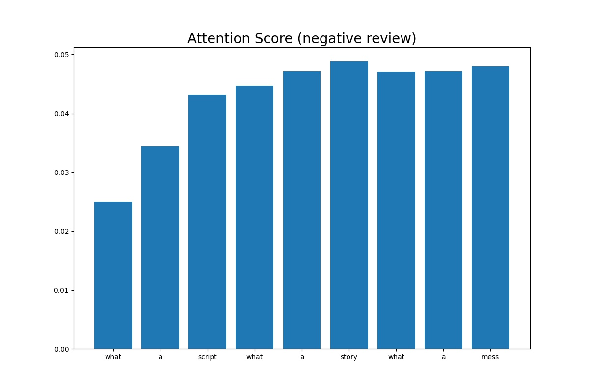

# Sentiment Classification LSTM
한국어 버전의 설명은 [여기](./docs/README_ko.md)를 참고하시기 바랍니다.

## Introduction
Using IMDb movie review data, we will create a sentiment classification model using an LSTM model.
This code allows us to create a sentiment classification model with or without attention.
For an explanation of the LSTM-based sentiment classification model and attention, please refer to [Sequence-to-Sequence (Seq2Seq) 모델과 Attention](https://ljm565.github.io/contents/RNN2.html).
<br><br><br>

## Supported Models
### Bidirectional LSTM and Attention
* A bidirectional LSTM using `nn.LSTM` is implemented.
* You can decide in `config/config.yaml` whether to use attention or not.
<br><br><br>

## Supported Tokenizer
### Custom Word Tokenizer
* Tokenization based on words for attention visualization.
<br><br><br>

## Base Dataset
* Base dataset for tutorial is [IMDb](http://ai.stanford.edu/~amaas/data/sentiment/).
* Custom datasets can also be used by setting the path in the `config/config.yaml`.
However, implementing a custom dataloader may require additional coding work in `src/utils/data_utils.py`.
<br><br><br>

## Supported Devices
* CPU, GPU, multi-GPU (DDP), MPS (for Mac and torch>=1.12.0)
<br><br><br>

## Quick Start
```bash
python3 src/run/train.py --config config/config.yaml --mode train
```
<br><br>

## Project Tree
This repository is structured as follows.
```
├── configs                           <- Folder for storing config files
│   └── *.yaml
│
└── src      
    ├── models
    |   └── model.py                  <- LSTM model file
    |
    ├── run                   
    |   ├── sentiment_prediction.py   <- Prediction result example print code
    |   ├── train.py                  <- Training execution file
    |   ├── validation.py             <- Trained model evaulation execution file
    |   └── vis_attention.py          <- Attention ratio visualization code for each word of attention model
    |
    ├── tools                   
    |   ├── tokenizers
    |   |    └── word_tokenizer.py    <- Word tokenizer file
    |   |
    |   ├── imdb_downloader.py        <- IMDb data download file  
    |   ├── model_manager.py          
    |   └── training_logger.py        <- Training logger class file
    |
    ├── trainer                 
    |   ├── build.py                  <- Codes for initializing dataset, dataloader, etc.
    |   └── trainer.py                <- Class for training, evaluating, and calculating accuracy
    |
    └── uitls                   
        ├── __init__.py               <- File for initializing the logger, versioning, etc.
        ├── data_utils.py             <- File defining the custom dataset dataloader
        ├── filesys_utils.py       
        ├── func_utils.py       
        └── training_utils.py     
```
<br><br>


## Tutorials & Documentations
Please follow the steps below to train a LSTM sentiment classification model.
1. [Getting Started](./docs/1_getting_started.md)
2. [Data Preparation](./docs/2_data_preparation.md)
3. [Training](./docs/3_trainig.md)
4. ETC
   * [Evaluation](./docs/4_model_evaluation.md)
   * [Attention Visualization](./docs/5_vis_attn.md)
   * [Print Sentiment Prediction Results](./docs/6_pred_sentiment.md)

<br><br><br>


## Training Results
### Sentiment Classification Results of LSTM w/ Attention
* Loss History<br>
<br><br>

* Accuracy History<br>
<br><br>
Model w/ attention: 0.884720<br><br>

* Samples of sentiment prediction (ground truth: 1.0 (positive), 0.0 (negative))<br>
    ```
    i saw [UNK] on broadway and liked it a great deal i don't know what happened with the film version because it was dreadful perhaps some dialogue that works on stage just sounds incoherent on screen anyway i couldn't wait for this film to be over the acting is universally over the top only kevin spacey has it together and he seems like he knows he's in a bad movie and can't wait to get out
    ******************************************
    It is positive with a probability of 0.216
    ground truth: 0.0
    ******************************************


    how do these guys keep going they're about 50 years old each and act as if they're only 30 they play 3 hours of music at every concert and barely break a sweat this dvd is their first concert in [UNK] brazil although the people don't speak english they try to [UNK] the words to the most famous rush songs and try to sing a foreign language at the concert with their best friends from tom [UNK] to the spirit of radio this concert dvd will keep you in the chair not wanting to pause or move away from the classics that you've listened to when you were young this is their [UNK] reunion tour started in 1974 i went to their [UNK] [UNK] concert and this was just as good although in [UNK] they didn't play [UNK] so i was upset they have [UNK] they have the trees they have [UNK] the pass driven [UNK] red [UNK] a [UNK] roll the bones [UNK] and much more 10 out of 10 because nothing else [UNK] if you never go to a rush concert then at least buy this dvd
    ******************************************
    It is positive with a probability of 0.961
    ground truth: 1.0
    ******************************************
    ```
    <br><br>


### Sentiment Classification Results of LSTM w/o Attention
* Loss History<br>
<br><br>

* Accuracy History<br>
<br><br>
Model w/o attention: 0.883560<br><br>

* Samples of sentiment prediction (ground truth: 1.0 (positive), 0.0 (negative))<br>
    ```
    this movie was awful plain and simple the animation scenes had absolutely terrible graphics it was very clear to see that this film had about the budget of my [UNK] bill the acting was just as bad i've seen better acting in pornographic films i would seriously like the hour and twenty minutes of my life back in fact i [UNK] on imdb just so that other people don't get sucked into watching this like i did don't get me wrong though i love scifi films this one seemed more like the intro to a video game i'm glad i only spent a dollar to see this one the story line reminded me of the movie pitch black a prisoner on a ship in outer space escapes oh my goodness what are we gonna do i would not even let this play in the background of my house while i was cleaning bottom line here you can do better
    ******************************************
    It is positive with a probability of 0.001
    ground truth: 0.0
    ******************************************


    the beloved rogue is a wonderful period piece it portrays [UNK] century paris in grand hollywood fashion yet offering a [UNK] side to existence there as it would be experienced by the poor and the snow it's constantly [UNK] about adding to the [UNK] of the setting brilliant the setting is enhanced by the odd cast of characters including [UNK] [UNK] and [UNK] a brilliant performance is turned in by john barrymore [UNK] only by the magnificent conrad [UNK] who portrays a [UNK] [UNK] louis [UNK] to perfection and yes [UNK] picks his nose on purpose pushing his portrayal to wonderfully [UNK] limits
    ******************************************
    It is positive with a probability of 0.816
    ground truth: 1.0
    ******************************************
    ```
<br><br>


### Sentiment Classification Attention Score Results
* Positive review attention score sample<br>
<br><br>

* Negative review attention score sample<br>
<br><br>


<br><br><br>
