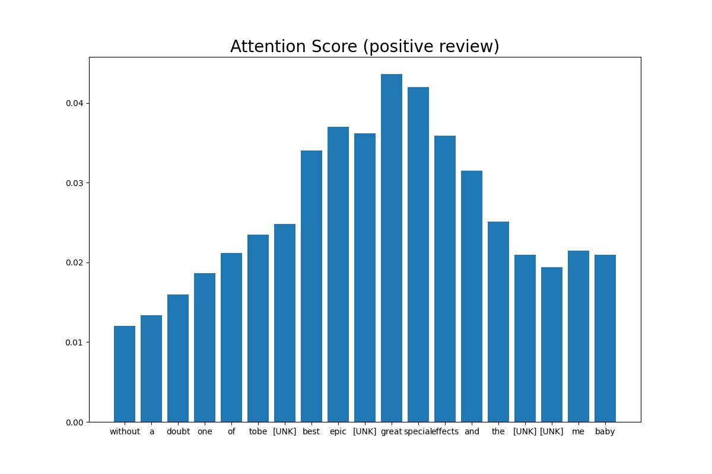
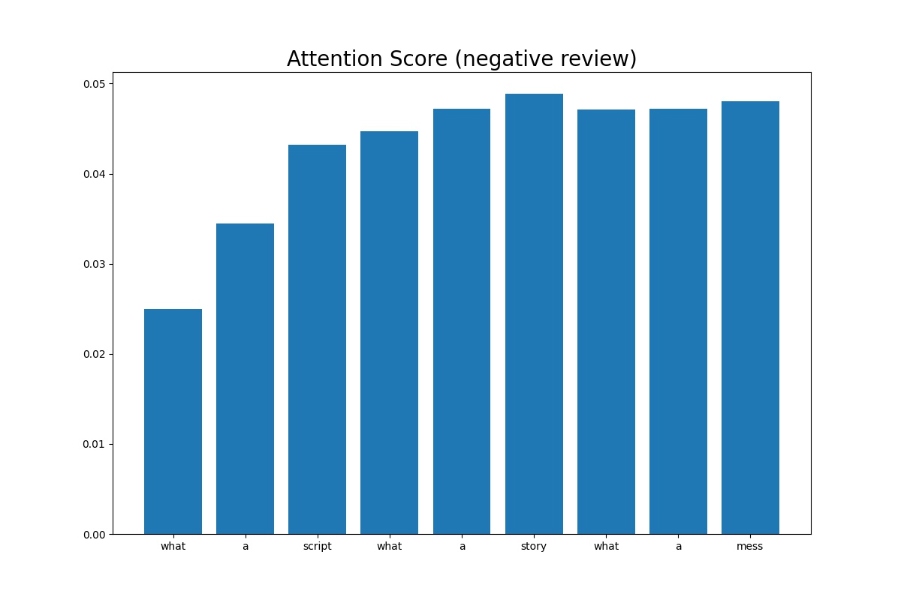

# Sentiment Classification LSTM
## 설명
IMDb 영화 리뷰 데이터 바탕으로 LSTM 모델을 사용하여 긍부정 감성 분류 모델을 제작합니다.
본 코드에서는 attention의 유무에 따른 감성 분류 모델을 제작할 수 있습니다.
LSTM 기반 감성 분류 모델과 이 모델의 attention에 대한 설명은 [Sequence-to-Sequence (Seq2Seq) 모델과 Attention](https://ljm565.github.io/contents/RNN2.html)을 참고하시기 바랍니다.
<br><br><br>

## 모델 종류
* ### Bidirectional LSTM and Attention
    긍부정 감성 분류 모델을 위해 Bidirectional LSTM을 사용합니다.
    또한 attention 모델 사용 여부를 결정할 수 있습니다.
<br><br><br>


## 토크나이저 종류
* ### Word Tokenizer
    단어 기준으로 토큰화(Attention 가시화를 위함).
<br><br><br>

## 사용 데이터
* 실험으로 사용하는 데이터는 [IMDb](http://ai.stanford.edu/~amaas/data/sentiment/) 데이터입니다.
<br><br><br>


## 사용 방법
* ### 학습 방법
    학습을 시작하기 위한 argument는 4가지가 있습니다.<br>
    * [-d --device] {cpu, gpu}, **필수**: 학습을 cpu, gpu로 할건지 정하는 인자입니다.
    * [-m --mode] {train, test}, **필수**: 학습을 시작하려면 train, 학습된 모델을 가지고 있어서 loss, accuracy, sample에 대한 attention score를 보고싶은 경우(attention 모델을 사용했을 경우)에는 test로 설정해야합니다. test를 사용할 경우, [-n, --name] 인자가 **필수**입니다.
    * [-c --cont] {1}, **선택**: 학습이 중간에 종료가 된 경우 다시 저장된 모델의 체크포인트 부분부터 학습을 시작할 수 있습니다. 이 인자를 사용할 경우 -m train 이어야 합니다. 
    * [-n --name] {name}, **선택**: 이 인자는 -c 1 혹은 -m test 경우 사용합니다.
    중간에 다시 불러서 학습을 할 경우 모델의 이름을 입력하고, test를 할 경우에도 test 할 모델의 이름을 입력해주어야 합니다(최초 학습시 config.json에서 정한 모델의 이름의 폴더가 형성되고 그 폴더 내부에 모델 및 모델 파라미터가 json 파일로 형성 됩니다).<br><br>

    터미널 명령어 예시<br>
    * 최초 학습 시
        ```
        python3 main.py -d cpu -m train
        ```
    * 중간에 중단 된 모델 이어서 학습 시
        <br>주의사항: config.json을 수정해야하는 일이 발생 한다면 base_path/config.json이 아닌, base_path/model/{model_name}/{model_name}.json 파일을 수정해야 합니다.
        ```
        python3 main.py -d gpu -m train -c 1 -n {model_name}
        ```
    * 최종 학습 된 모델의 test set에 대한 loss, accuracy를 확인할 시
        <br>주의사항: config.json을 수정해야하는 일이 발생 한다면 base_path/config.json이 아닌, base_path/model/{model_name}/{model_name}.json 파일을 수정해야 수정사항이 반영됩니다.
        ```
        python3 main.py -d cpu -m test -n {model_name}
        ```
    <br><br>

* ### 모델 학습 조건 설정 (config.json)
    **주의사항: 최초 학습 시 config.json이 사용되며, 이미 한 번 학습을 한 모델에 대하여 parameter를 바꾸고싶다면 base_path/model/{model_name}/{model_name}.json 파일을 수정해야 합니다.**
    * is_attn: {0, 1} 중 선택. Attention 모델을 제작한다면 1, 아니면 0. 
    * base_path: 학습 관련 파일이 저장될 위치.
    * model_name: 학습 모델이 저장될 파일 이름 설정. 모델은 base_path/model/{model_name}/{model_name}.pt 로 저장.
    * loss_data_name: 학습 시 발생한 loss data를 저장하기 위한 이름 설정. base_path/loss/{loss_data_name}.pkl 파일로 저장. 내부에 중단된 학습을 다시 시작할 때, 학습 과정에 발생한 loss 데이터를 그릴 때 등 필요한 데이터를 dictionary 형태로 저장.
    * vocab_size: 최대 vocab size 설정.
    * max_len: 토큰화 된 리뷰 데이터의 최대 길이.
    * hidden_size: LSTM 모델의 hidden dimension.
    * num_layers: LSTM 모델의 레이어 수.
    * dropout: LSTM dropout 비율.
    * batch_size: batch size 지정.
    * epochs: 학습 epoch 설정.
    * lr: learning rate 지정.
    * result_num: 모델 테스트 시, 결과를 보여주는 sample 개수.
    * early_stop_criterion: Validation set의 최대 accuracy를 내어준 학습 epoch 대비 설정된 숫자만큼 epoch이 지나도 나아지지 않을 경우 학습 조기 종료.
    * visualize_attn: {0, 1} 중 선택. 1이면 짧은 리뷰에 한에서 랜덤으로 하나의 리뷰를 선택하여 각 단어별 attention score 결과를 {basepath}/result 폴더에 이미지로 저장.
    <br><br><br>


## 결과
* ### Sentiment Classification LSTM Attention 사용 모델 결과
    * Loss History<br>
    <br><br>

    * Accuracy History<br>
    <br><br>
    Attention 사용한 모델: 0.884720<br><br>

    * 감성 분류 결과 샘플 (ground truth: 1.0 (positive), 0.0 (negative))<br>
        ```
        i saw [UNK] on broadway and liked it a great deal i don't know what happened with the film version because it was dreadful perhaps some dialogue that works on stage just sounds incoherent on screen anyway i couldn't wait for this film to be over the acting is universally over the top only kevin spacey has it together and he seems like he knows he's in a bad movie and can't wait to get out
        ******************************************
        It is negative with a probability of 0.784
        ground truth: 0.0
        ******************************************


        how do these guys keep going they're about 50 years old each and act as if they're only 30 they play 3 hours of music at every concert and barely break a sweat this dvd is their first concert in [UNK] brazil although the people don't speak english they try to [UNK] the words to the most famous rush songs and try to sing a foreign language at the concert with their best friends from tom [UNK] to the spirit of radio this concert dvd will keep you in the chair not wanting to pause or move away from the classics that you've listened to when you were young this is their [UNK] reunion tour started in 1974 i went to their [UNK] [UNK] concert and this was just as good although in [UNK] they didn't play [UNK] so i was upset they have [UNK] they have the trees they have [UNK] the pass driven [UNK] red [UNK] a [UNK] roll the bones [UNK] and much more 10 out of 10 because nothing else [UNK] if you never go to a rush concert then at least buy this dvd
        ******************************************
        It is positive with a probability of 0.961
        ground truth: 1.0
        ******************************************
        ```
    <br><br>


* ### Sentiment Classification LSTM Attention 사용하지 않은 모델 결과
    * Loss History<br>
    <br><br>

    * Accuracy History<br>
    <br><br>
    Attention 사용하지 않은 모델: 0.883560<br><br>

    * 감성 분류 결과 샘플 (ground truth: 1.0 (positive), 0.0 (negative))<br>
        ```
        this movie was awful plain and simple the animation scenes had absolutely terrible graphics it was very clear to see that this film had about the budget of my [UNK] bill the acting was just as bad i've seen better acting in pornographic films i would seriously like the hour and twenty minutes of my life back in fact i [UNK] on imdb just so that other people don't get sucked into watching this like i did don't get me wrong though i love scifi films this one seemed more like the intro to a video game i'm glad i only spent a dollar to see this one the story line reminded me of the movie pitch black a prisoner on a ship in outer space escapes oh my goodness what are we gonna do i would not even let this play in the background of my house while i was cleaning bottom line here you can do better
        ******************************************
        It is negative with a probability of 0.999
        ground truth: 0.0
        ******************************************


        the beloved rogue is a wonderful period piece it portrays [UNK] century paris in grand hollywood fashion yet offering a [UNK] side to existence there as it would be experienced by the poor and the snow it's constantly [UNK] about adding to the [UNK] of the setting brilliant the setting is enhanced by the odd cast of characters including [UNK] [UNK] and [UNK] a brilliant performance is turned in by john barrymore [UNK] only by the magnificent conrad [UNK] who portrays a [UNK] [UNK] louis [UNK] to perfection and yes [UNK] picks his nose on purpose pushing his portrayal to wonderfully [UNK] limits
        ******************************************
        It is positive with a probability of 0.816
        ground truth: 1.0
        ******************************************
        ```
    <br><br>


* ### Sentiment Classification Attention Score 결과
    * Positive review attention score sample<br>
    <br><br>

    * Negative review attention score sample<br>
    <br><br>


<br><br><br>
